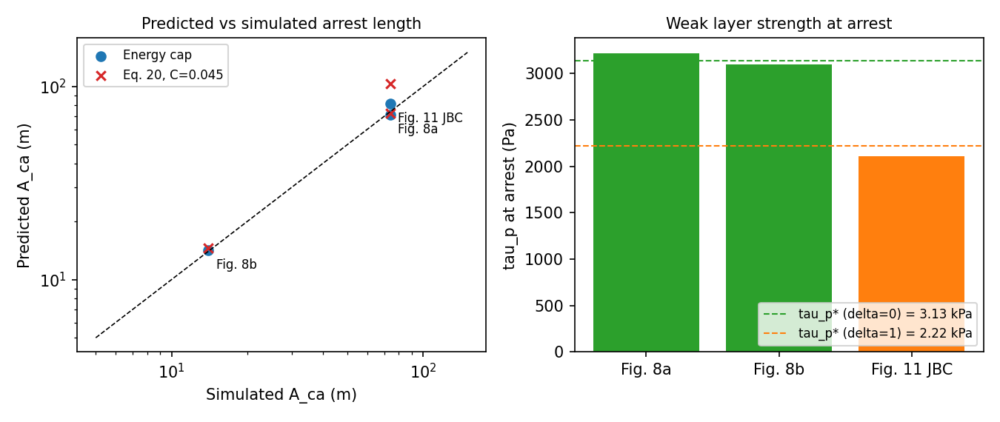
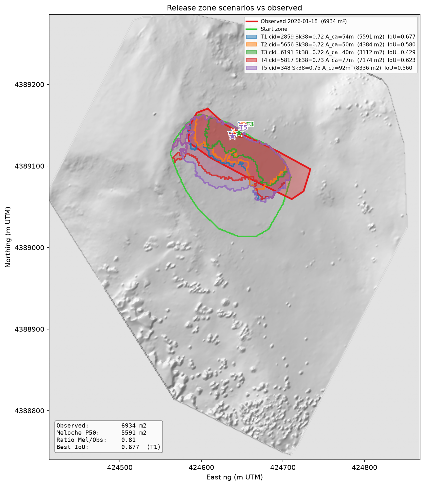

# Avalanche Release Area Delineation: Methods and Jan 18 2026 Validation

Crack-arrest indices for dry-slab avalanches in two groups:

1. **Published strength-based scalings** from Meloche et al. (2025, JGR) and Meloche et al. (ISSW 2026).
2. **An energy-cap hypothesis** (new, untested beyond three simulated cases) that treats slab fracture as a cap on the energy available to drive the weak-layer crack.

Status: unit-tested against three calibration runs from Meloche et al. (2025) (`tests/test_arrest_indices.py`). Not validated against field data or a broad simulation set.

Units are SI (Pa, m, kg m⁻³, J m⁻²) with angles in degrees.

Figures marked "JGR" are reproduced from Meloche et al. (2025), *JGR Earth Surface*, open access under CC BY 4.0. Image files are in `figures/`.

---

## 1. Notation

| Symbol | Meaning | Code |
|---|---|---|
| ρ, h | slab density, slab thickness (slope-normal) | `rho`, `h` |
| E, ν | slab Young's modulus, Poisson's ratio | `E`, `nu` |
| E′ = E/(1−ν²) | plane-stress modulus | `plane_stress_modulus` |
| G = E/(2(1+ν)) | slab shear modulus | `shear_modulus` |
| σt | slab tensile strength | `sigma_t` |
| G_wl, D_wl | weak-layer shear modulus, thickness | `G_wl`, `D_wl` |
| K_wl = G_wl/D_wl | weak-layer interface stiffness (Pa/m) | `weak_layer_stiffness` |
| τp, τp0 | weak-layer shear strength, value at trigger zone | `tau_p0` |
| θ | upslope gradient of τp (Pa/m) | `theta` |
| δ | weak-layer softening coefficient, (u_r − u_c)/u_c | `delta` |
| ψ, φ | slope angle, snow friction angle (27°) | `psi_deg`, `phi_deg` |

Check on K_wl: the JGR paper states "K_wl = 0.2 MPa" but also u_c = 0.2 mm at τp = 1 kPa. Only K_wl = G_wl/D_wl = 0.2 MPa / 0.04 m = 5 MPa/m reproduces u_c = 0.2 mm, so the code uses G_wl/D_wl.

---

## 2. Published relations (Meloche et al. 2025, ISSW 2026)

> **Figure note.** The six `figures/jgr_fig*.png` images referenced in this
> section are crops from Meloche et al. (2025) and are **not committed** — this
> repository is public and `papers/` is gitignored for the same reason, so those
> links only resolve in a local working copy that has them. Consult the paper
> directly (doi:10.1029/2025JF008470) for the figures. The two figures that do
> ship, `energy_cap_check.png` and `release_comparison_20260118.png`, are ours.

**Elastic length (upslope, mode II)**

Λ = √( E h D_wl / ((1−ν²) G_wl) )

**Gravitational and residual shear**

τg = ρ g h sin ψ, τr = ρ g h cos ψ tan φ

Shear propagation is only sustained when ψ > φ (`sustained` flag).

**Slab tension gradient.** Quasi-static (Eq. 17):

k_f = ρ g sin ψ (1 − tan φ / tan ψ)

Dynamic (Eq. 18), with crack speed ȧ = 1.6 c_s (supershear):

k_x = k_f c_p² / (c_p² + ȧ²), c_p = √(E′/ρ), c_s = √(G/ρ)


*JGR Fig. 3. Faster cracks build slab tension more slowly. At ȧ ≈ c_p the gradient is half the quasi-static value.*

**Tensile lengths (distance to first slab fracture)**

L_t = σt / k_f, L_dyn = σt / k_x

**Arrest length, elastic slab (Eq. 19)**

A_ca / L_ss ∝ ( τg / (θ Λ √(1+δ)) )^(3/2)

The paper gives no constant of proportionality, so the pipeline emits only the
dimensionless group `Pi1_elastic` = τg / (θ Λ √(1+δ)) and not an absolute
elastic arrest length. (An earlier revision wrote an `A_ca_elastic` column as
`L_ss · Π₁^1.5`, i.e. silently assuming the constant equals 1, which produced
medians of ~7 800 m. That column has been removed.)


*JGR Fig. 7. Elastic-slab collapse (a). In (b), brittle runs fall off the elastic trend, which shows slab fracture changes the arrest mechanism.*

**Arrest length, brittle slab (Eq. 20)**

A_ca / L_t = C · X · √(σt/τg), X = τg / (θ Λ √(1+δ))

The paper gives this as a proportionality. C = 0.045 is my two-point fit to the Fig. 8 runs and is the code default.


*JGR Fig. 10. Brittle-slab scaling with a slope-1 reference line.*

C = 0.045 verified by direct computation from the Fig. 8 inputs (see calibration table in §3 and `test_arrest_indices.py`). The arithmetic: τg = 702 Pa, Λ = 0.663 m, L_t = 15.67 m; θ = 30 gives A_ca = 72.7 m (observed 74 m); θ = 150 gives 14.5 m (observed 14 m). The dashed line in Fig. 10a is a 1:1 reference line through the data, not a separate best-fit; no discrepancy remains.


*JGR Fig. 9. A_ca falls roughly as 1/θ. Higher σt and lower E lengthen arrest. Crosses are single-fracture arrests, circles multiple.*

**Release size index (ISSW 2026, preliminary).** The ISSW 2026 paper defines a_t as the distance to the first slab fracture (obtained directly from MPM simulations). In the code, a_t is approximated as L_dyn (dynamic tensile length = σt/k_x), which is the analytical prediction for where the first fracture occurs.

- RSI 1 (arrest): a_t/a_c < 6–7 (code uses 6.5)
- RSI 2 (sub-Rayleigh en-echelon): a_t/a_c ≥ 6.5 and a_t/a_sc < 1
- RSI 3 (supershear en-echelon): a_t/a_sc ≥ 1

a_c and a_sc are not computed in the pipeline and must be supplied as inputs. The 6–7 threshold was derived from ISSW 2026 simulations using D_wl = 0.1 m, E = 3 MPa, ρ = 250 kg m⁻³, σt = 2–16 kPa — different from the JGR calibration parameters. Applicability to other parameter ranges is untested. For a_sc, the ISSW paper estimates it from the corresponding purely elastic simulation (no slab fractures allowed).

---

## 3. Energy-cap hypothesis

### Idea

During propagation the unsupported slab stores elastic energy, which pays for weak-layer fracture at the crack tip. A slab fracture resets the tension upslope of it to zero. The energy the slab can deliver per unit crack advance is therefore capped at roughly that of a segment loaded to its tensile strength. Arrest occurs where the weak layer's fracture energy exceeds that cap.

### Slab energy cap

For a slab strip with tension rising to σt, the energy delivered per unit advance at the loaded end is:

G_slab = σt² h / (2E′)

### Weak-layer fracture energy

Integrating the softening interface law of Meloche et al. (2025, Eq. 15), linear to (u_c, τp) and then linear down to τr at u_r = u_c(1+δ), and approximating:

G_c(τp) ≈ (τp − τr)² (1+δ) / (2 K_wl)

The code uses τr = 0 by default (`use_residual=False`). That is the version that matched the simulations below. Including τr is an option, not a recommendation.

### Arrest criterion

Arrest when G_c(τp(x)) ≥ R · G_slab.

This defines a critical weak-layer strength:

τp* = τr + √( 2 K_wl R G_slab / (1+δ) )

For a linear strength ramp τp(x) = τp0 + θx beyond the steady-state zone:

A_ca = (τp* − τp0) / θ

R absorbs dynamic effects and the approximations above. Two options are provided:

- `R = 0.48`: fitted to the two Fig. 8 runs (default).
- `R = 'dynamic'`: R = k_x/k_f at ȧ = 1.6 c_s (0.53 for ν = 0.3). This is a speculative physical interpretation. It lands within 10% of the fit, which may be coincidence.


*JGR Fig. 8. Weak-layer strength and shear (top), slab tension and slab fractures (middle), crack speed (bottom). Arrest at 94 m (θ = 30) and 34 m (θ = 150).*


*JGR Fig. 11. Field gradient (θ ≈ 15 Pa/m) with δ = 1. Crack speed drops to zero near 94 m in panel (d).*

### Check against Meloche et al. (2025)

Inputs: ρ = 250 kg m⁻³, h = 0.5 m, ψ = 35°, E = 4 MPa, σt = 6 kPa, G_wl = 0.2 MPa, D_wl = 0.04 m, τp0 = 1 kPa, L_ss = 20 m.

| Run | θ (Pa/m) | δ | Observed A_ca (m) | Energy cap (m) | Eq. 20, C = 0.045 (m) |
|---|---|---|---|---|---|
| Fig. 8a | 30 | 0 | 74 (arrest at 94 m) | 71 | 73 |
| Fig. 8b | 150 | 0 | 14 (arrest at 34 m) | 14 | 15 |
| Fig. 11, JBC | 15 | 1 | ~74 (arrest ~94 m, read from Fig. 11d) | 81 | 103 |

The first two rows are the calibration data for both methods, so they don't discriminate. JBC is the only out-of-sample point, and its observed value is read off a plot.



*My plot from `arrest_indices.py`. The dashed lines on the right are τp* from the energy-cap criterion with R = 0.48.*

The notable observation is that both Fig. 8 runs arrest at nearly the same weak-layer strength (3.2 and 3.1 kPa) despite a fivefold change in θ. A threshold-strength criterion predicts exactly this behavior.

### How the two frameworks differ

Both give A_ca ∝ 1/θ, so they can only be separated through other parameters:

| Parameter | Energy cap | Eq. 20 |
|---|---|---|
| σt | A_ca roughly ∝ σt | ∝ σt^1.5 |
| E | through √(1/E′) in τp* | through Λ and L_t |
| δ | through (1+δ)^(−1/2) in τp* | through (1+δ)^(−1/2) in X |

The σt dependence is the cleanest discriminating test.

### Cross-slope (mode III), hypothesis only

The code provides:

- `elastic_length_cross`: Λ_III = √( G h D_wl / G_wl ), giving Λ_III/Λ_II = √((1−ν)/2) ≈ 0.59 at ν = 0.3. This is my derivation, using the slab shear modulus for antiplane loading.
- `slab_energy_cap_cross`: G_slab,III = τ_flank² h / (2G), where τ_flank is a slab flank (shear) strength. No parameterization exists, so it is a user input.

**Pipeline status.** The propagation code splits arrest evaluation into
along-slope and cross-slope branches (`release_geometry.directional_lambda`),
but the cross-slope branch currently resolves to the mode II Λ, gated behind
`config.USE_MODE3_LAMBDA = False`, pending Gaume's antiplane formula. The split
was verified to be a bit-for-bit no-op on the Jan 18 results.

**A constant Λ_III/Λ_II ratio cannot change the BFS result.** This is worth
knowing before the formula arrives. The Λ continuity gate tests the *relative*
change (Λ_nbr − Λ_cur)/Λ_cur, which is invariant under any uniform rescaling of
Λ; and the only absolute Λ threshold, `MIN_PROPAGATION_LAMBDA` = 0.1 m, is never
approached (min Λ_II = 0.54 m on Jan 18, so min Λ_III = 0.32 m). Since the
current derivation gives Λ_III/Λ_II = √((1−ν)/2), a constant for constant ν,
switching to it provably changes nothing. Confirmed by running both flag
states: identical areas and IoU.

A real Λ_III will only move the flanks if it carries different *spatial
structure* — i.e. if it depends on material properties that vary across
clusters differently from E′. Injecting a spatially varying Λ_cross does change
every release area, which confirms the plumbing is live rather than dead.

### Mode III crack-speed cap — implemented

Mode III (antiplane) cracks cannot exceed the shear wave speed c_s
(Broberg 1989), whereas upslope mode II cracks run supershear at ȧ ≈ 1.6 c_s.
Because the dynamic tension gradient is

k_x = k_f c_p² / (c_p² + ȧ²)

a *slower* crack builds slab tension *faster* per unit advance. The distance to
first slab fracture is therefore shorter cross-slope:

L_dyn,III / L_dyn,II = k_x,II / k_x,III

Since c_s²/c_p² = (1−ν)/2, both E and ρ cancel and the ratio is a function of ν
and the two speed ratios alone (`arrest_indices.mode3_length_ratio`):

| ν | 0.2 | 0.3 | 0.4 |
|---|---|---|---|
| L_dyn,III / L_dyn,II | 0.692 | **0.712** | 0.735 |

**How it enters the pipeline.** Unlike Λ_III, this is *not* scale-invariant — it
is an absolute cap on lateral propagation distance, so it does change results.
`propagate_crack` composes it with the Gaume θ width as a minimum, because
arrest occurs at whichever constraint binds first:

d_lat = min( gaume_width , A_ca · 0.712 ) · size_factor

Controlled by `config.USE_MODE3_SPEED_CAP` (default on),
`MODE2_SPEED_RATIO = 1.6` and `MODE3_SPEED_RATIO = 1.0`. Setting the flag off is
bit-for-bit identical to the pre-cap behaviour.

**Effect on Jan 18** (`--max-clusters 2000`, observed crown 6 934 m²). The cap
binds on 2 of 5 triggers; the other three were already Gaume-limited below it:

| Trigger | d_lat gaume → used | Area off → on (m²) | IoU off → on |
|---|---|---|---|
| 2859 | 60 → 35 m | 7 209 → 5 389 | 0.608 → 0.623 |
| 5656 | 26 m (unbound) | 4 647 → 4 647 | 0.519 |
| 2858 | 21 m (unbound) | 4 521 → 4 521 | 0.486 |
| 348  | 41 m (unbound) | 6 405 → 6 405 | 0.667 |
| 1068 | 32 → 20 m | 7 672 → 7 221 | 0.556 → 0.511 |

Median area 6 405 → 5 389 m² (ratio 0.92 → 0.78); best IoU unchanged at 0.667;
mean IoU 0.567 → 0.561.

**So the cap makes the aggregate fit slightly worse on the only validation
event.** Two readings, and this is not resolved:

1. The cap is right and something else over-arrests. The model already
   *under*-predicted area (ratio 0.92), so any additional arrest constraint
   worsens the ratio. The uncalibrated `TAU_G_ABS_FLOOR` (350 Pa) and the
   Λ/thickness discontinuity heuristics are the obvious suspects.
2. **Only the restrictive half of mode III physics is implemented.** The speed
   cap shortens lateral propagation, but because G < E′ an equal-strength slab
   has a *larger* energy cap cross-slope — G_slab,III = τ_flank² h / (2G)
   versus σt² h / (2E′) — which pushes the other way. That term needs a slab
   flank strength τ_flank, for which no parameterisation exists, so it is not
   coded. Implementing one half of a two-sided effect biases toward
   over-arrest, and the IoU drop is consistent with exactly that.

Per the no-tuning rule the cap is left on, because it follows from Broberg
(1989) independently of this event; it is not disabled merely because one
event's IoU fell. But do not read the drop as evidence the cap is wrong — read
it as evidence that cross-slope arrest is still incompletely modelled.

If the JGR attribution of lateral arrest to weak-layer heterogeneity is right,
then neither Λ_III nor the speed cap is the dominant control, and the missing
ingredient is spatial τp variability on the flanks rather than slab mechanics.

Revised 2026-10-09: "spatial τp variability" turns out not to mean *adding*
variability. θ is already sampled at 3.3 m and is already ~85% local noise,
and our measured σ_local (69 Pa) is 7× below Appendix E's 500 Pa. The open
item is the **scale** θ is evaluated at, not a missing random field — see §5,
"θ is a function of the lag it is measured at".

Note also that the lateral cap now depends on this doubly. Since the
cross-slope θ sampling fix of 2026-10-09, `theta_cross` is measured along the
true cross axis, and `theta_along` is now measured the same way about the fall
line rather than taken from the CSV's isotropic k-NN mean. The second half
matters because of the lag dependence above: pairing a ~3.3 m isotropic
numerator with a 5–50 m directional denominator inflated the ratio several-fold
on θ(d) = 3.87 + 72/d alone, which is why it kept saturating at
`GAUME_ASPECT_CAP`. Jan 18 Gaume widths went 55/44/50/155/38 m →
39/34/34/112/20 m across the two fixes.

Both are nonetheless **inert on the default configuration**: the mode III speed
cap binds on all 5 Jan 18 triggers, so `d_lat = min(gaume, A_ca·0.712)` is set
by the cap and the Gaume path never decides the lateral extent. That is itself
worth recording — the θ-ratio width is dormant on this event, and any future
work on flank arrest should know it is the speed cap, not Gaume, that is
active.

---

## 4. Inputs from SNOWPACK

| Input | Source | Note |
|---|---|---|
| ρ, h | layer-weighted slab density and thickness above weak layer | check slope-normal vs vertical |
| E | `arrest_indices.slab_modulus(rho, relation)` | default `vanherwijnen2016`: E = 0.93 ρ^2.8 Pa. Option `project_fit`: E = (ρ/300)^2.5 · 4 MPa |
| σt | `arrest_indices.slab_tensile_strength` | σt = (ρ/300)^1.4 · 5 kPa — in-house hand-fit, no published source |
| τp0 | shear strength output (`.pro` code 0508, to verify) | In `compute_meloche_features()`, each cluster's own `wl_shear_strength` is used as τp0 — a per-cluster index: "if crack initiates here, how far must WL strength rise to arrest it?" |
| G_wl, D_wl | weak-layer modulus and thickness | paper used 0.2 MPa, 0.04 m |
| θ | k-nearest-neighbour gradient of τp between cluster centroids (§5) | needs a spatial field, not one profile. `arrest_indices.shear_gradient` (transect polyfit) is a separate helper the pipeline does not use |
| δ | not observable | paper range 0–2 |

Without θ, the energy framework still gives τp* and R0 = G_c(τp0)/G_slab, a per-profile index of how far weak-layer strength must rise before a crack stops.

**Provenance of E and σt.** Both are selectable in
`arrest_indices`; each option cites its own source.

| Option | Formula | Source |
|---|---|---|
| `vanherwijnen2016` (**default**) | E = 0.93 ρ^2.8 Pa | van Herwijnen et al. (2016) *J. Glaciol.* 62(236) 997–1007, **Eq. 8**; fitted to PST field measurements over ~100–350 kg m⁻³, Spearman r = 0.69, NRMSE 13% |
| `project_fit` | E = (ρ/300)^2.5 · 4 MPa | **this project, not a publication.** A hand-fit through ~2/4/6 MPa at ρ = 200/300/350 — i.e. through the *range* van Herwijnen et al. report, not their regression |
| σt (only option) | σt = (ρ/300)^1.4 · 5 kPa | **this project, not a publication.** Anchored at ~5 kPa at ρ = 300, inside the 2–10 kPa Meloche et al. (2025) swept. Neither paper publishes a σt(ρ) regression |

`project_fit` sits a factor **1.63–2.19 below** the van Herwijnen regression over
ρ = 150–400 (2.01× at ρ = 300). This matters for the calibration of `C_FIT`:
Meloche et al. (2025) Table 1 fixes ρ = 250 kg m⁻³ in all four campaigns and
treats E as a *swept constant* — 4 MPa, or 2-4-6 MPa in the pure-elastic and
brittle-slab campaigns — so there is **no E(ρ) relation in Meloche at all**.
`C_FIT = 0.045` was fitted at E = 4 MPa, ρ = 250, σt = 6 kPa. At that density
`project_fit` gives 2.54 MPa (0.63× the calibration value, and since
A_ca ∝ E^−0.5 that inflates A_ca by 1.26×), whereas `vanherwijnen2016` gives
4.82 MPa (1.20×). The default is the one consistent with the calibration point.

The σt exponent 1.4 was chosen to pass through its anchor point, so it carries
no fitted uncertainty and has not been validated outside 200–350 kg m⁻³. Jan 18 slab densities (264–332 kg m⁻³,
§6) sit inside that window, but Λ ∝ √E and G_slab ∝ σt²/E, so both frameworks
inherit this choice directly. Replacing these with a cited regression is the
single highest-value improvement to the input chain.

### Parameter generation chain

Every slab parameter below is derived from the SNOWPACK element arrays in one
pass through `snowpack_features.profile_features`, which delegates the
layer-resolved part to `arrest_indices.aggregate_slab`. The steps are given in
the order they execute, because each consumes the previous one's output.

**(a) Element thickness.** SNOWPACK's `z` is exactly `height_above_ground − HS`,
so `np.diff` of sorted `z` with the ground prepended at `−HS` recovers each
element's own thickness, and those thicknesses sum to `HS`. This was verified to
machine precision against the zarr `height` variable (`element_thickness()`).
Element thicknesses span 3–38 mm within a single profile, so the distinction
below is not cosmetic.

**(b) Thickness weighting.** All bulk slab means are thickness-weighted,
`⟨x⟩ = Σ x_i dz_i / Σ dz_i`, so that ρh is the true slab load per unit area and
E and σt see a mass-weighted bulk density. A plain element mean over-weights
thin layers; measured on Jan 18 the correction is ρ ×1.013, E ×1.033,
τg ×1.004. A layer's thickness is likewise the **sum of its elements' dz**, not
the span of their `z`, which silently omits the basal element — `wl_thickness`
had been undercounting D_wl by a median 23% (p95 49%). Because the basal weak
layer starts at the ground, `D_wl == hs − slab_thickness` exactly, which is a
useful patch for pre-fix CSVs. Since Λ ∝ √D_wl, Λ rose ×1.13 and A_ca fell
×0.86; end-to-end on Jan 18 the best IoU moved **0.667 → 0.636**. The fit got
*worse* — an inflated A_ca had been partly compensating an under-covered crown.
That is not grounds to revert a verified identity, and not a licence to re-tune
anything else.

`wl_shear_strength` (τp) is deliberately left a plain element mean: weighting it
is a modelling choice, not a bug fix, because a crack runs in the weakest
sublayer and τp cascades into θ, τp* and the trigger ranking.

**(c) Per-layer tensile strength and facetedness.** Each element gets
σt,i = σt,RG(ρ_i)·(1 − a f_i) (`layer_tensile_strength`), where σt,RG is the
project σt(ρ) above and f ∈ [0,1] is a facetedness index,
f = 1 − sphericity for non-dendritic layers and 0 otherwise (`facetedness`).
The knockdown a = `FACET_STRENGTH_FACTOR` = 0.5 encodes the observation that
faceted snow is roughly half as strong in tension as rounded snow at equal
density (Jamieson & Johnston 1990). Using a continuous f rather than a grain-type
switch means neighbouring cells cannot step discontinuously across a grain-class
boundary. Our rounded-grain layers sit at sphericity ≈ 0.86, so they still carry
f ≈ 0.14 and lose ~7% of σt; `FACET_SP_REF` (default `None`) optionally anchors
f so that typical RG keeps the unmodified σt,RG(ρ).

**(d) Slab-scale aggregation.** Two reductions, both over the slab elements:

| Quantity | Rule | Reading |
|---|---|---|
| `E_eff` | Σ E_i dz_i / h (`effective_modulus`) | iso-strain (Voigt) slope-parallel stiffness |
| `sigma_t_mean` | Σ σt,i dz_i / h (`tensile_strength_mean`) | full load redistribution across layers — an upper bound |
| `sigma_t_wl` | E_eff · minᵢ(σt,i/E_i) (`tensile_strength_weakest_link`) | weakest link: the slab fails when the lowest-failure-strain layer reaches its own strength, every layer at the common iso-strain value |

`sigma_t_wl ≤ sigma_t_mean` always, with equality only when σt,i/E_i is uniform.
The argmin index is retained as the **controlling layer** (`wl_ctrl_index`,
`wl_ctrl_depth`, `wl_ctrl_thickness`) and is what the ligament bound in (f)
treats as a crack.

**(e) Fracture toughness K_Ic(ρ).** Selectable, each option citing its own
measurement (`k_ic`, `K_IC_RELATIONS`). Neither available relation is a
slab-tension measurement at avalanche scale, which is the central caveat on
everything in (f).

| Option | Formula | Source and caveat |
|---|---|---|
| `schweizer2004` (**default**) | K_Ic = A₄ (ρ/ρ_ice)^exp / √d_max, A₄ = 0.35 kPa·m | Schweizer, Michot & Kirchner (2004) *Ann. Glaciol.* 38, 1–8, **Eq. 8** (r = 0.98), which the paper states replaces its own Eqs. 5 and 6 by folding in the d_max^(−1/2) dependence — the latter consistent with ice (Petrenko & Whitworth 1999). Notched cantilever beams in a cold laboratory. **The printed Eq. 8 exponent is 1.9**; we default to 2.0 (`SCH2004_EXP`; the abstract says "about 2"), which is 11% low at ρ = 300 and 17% low at ρ = 150. `SCH2004_EXP_PAPER` restores 1.9. |
| `kirchner2000` | K_Ic = 7.84 (ρ/ρ_ice)^2.3 kPa·m^0.5 | Kirchner et al. (2000) *Phil. Mag. A* 80(5). **Treat as a LOWER BOUND**: these are *apparent* toughnesses from small cantilever beams, so they carry the small-specimen size effect, and a slab-scale crack is far larger than the beams. |
| `borstad2013` | — | **gated, raises `NotImplementedError`.** Bronze OA at Wiley only, no repository copy, so the regression has never been sourced and quoted back. |

d_max = `DMAX_FACTOR` · grain size, **both in metres**. Our zarr `grain_size` is
already in m (median 5.9 × 10⁻⁴); raw SNOWPACK `.pro` output is in mm.

*Validity range and clamping.* `schweizer2004` was fitted over 80–300 kg m⁻³
(series C–F, chosen to resolve the density dependence, span 80–250; the abstract
quotes 100–300 across all series A–F) — below our median slab density. `k_ic()`
therefore clamps ρ into the fitted range **for the K_Ic evaluation only**, so a
single out-of-range element cannot poison a thickness-weighted ligament; density
is not modified anywhere else, and `clamp=False` restores NaN-outside-range.
`k_ic_n_clamped()` reports the count per profile. Over the full space-time run
this clamps a median **46 of 81** slab layers (p95 147), 94.3% of slabs having at
least one clamped layer, so K_Ic is effectively saturated across most of the
slab. `kirchner2000`, fitted to 540 kg m⁻³, clamps almost nothing (median 0,
14.8% of slabs).

**(f) Ligament (edge-crack) bound — hypothesis, not a published criterion.**
The controlling layer from (d) is treated as a crack of length a = its own
thickness in a slab of thickness h loaded in slope-parallel tension; K_Ic and
σt come from the **intact** layers (thickness-weighted over the slab minus that
layer). The El Haddad short-crack correction is the default:

    sigma_c = K_Ic / (F(a/h) sqrt(pi (a + a0))),   a0 = (K_Ic / (F sigma_t_lig))^2 / pi

after El Haddad, Topper & Smith (1979), with a₀ the intrinsic flaw size that
reconciles the LEFM and strength limits. `F(a/h)` is the single-edge-notch
tension factor of Tada, Paris & Irwin (polynomial, valid to a/h ≤ 0.6), or the
Feddersen secant form for an embedded crack. Using the **same** `F(a/h)` in both
places makes the a → 0 limit recover `sigma_t_lig` exactly, with no iteration
(asserted to rel 1e-9 in `tests/test_layered_slab.py`).
`self_consistent_a0=True` instead solves a₀ at F(a₀/h) iteratively and is kept
only as an option — its a → 0 limit is merely σt·F(a₀/h)/F(0).
`model='lefm'` gives the uncorrected form, which overshoots `sigma_t_lig` on
thin controlling layers. A bound is withheld (NaN) when a₀ ≥ h: the intrinsic
flaw then exceeds the slab and the LEFM geometry is void.

**Not validated.** No K_Ic for snow slabs in tension has been verified against a
source we hold, and the ligament bound has never been fed into the BFS or scored
against an observed crown.

### Measured parameter statistics (full space-time run)

One pass over the Little Professor domain, all clusters × all 501 six-hourly
steps (2025-11-26 → 2026-03-31) = 3 289 065 profiles, of which 2 169 737
(66.0%) resolved a slab. Medians with [p5, p95]. Nothing here is a validation —
these are the generated parameter distributions.

Independent of the K_Ic option:

| Quantity | Full space-time | Jan 18 2026 12:00 |
|---|---|---|
| slab thickness h (m) | 1.808 [0.767, 4.460] | 1.629 [0.806, 4.661] |
| slab density ρ (kg m⁻³) | 313.7 [190.5, 369.4] | 327.0 [290.8, 346.5] |
| slab layers per profile | 81 [36, 198] | 72 [39, 208] |
| σt_mean / σt(bulk) | 0.875 [0.770, 0.985] | 0.860 [0.748, 0.953] |
| σt_wl / σt_mean | 0.650 [0.514, 0.739] | 0.676 [0.568, 0.747] |
| f (thickness-weighted) | 0.256 [0.042, 0.480] | 0.296 [0.100, 0.526] |
| controlling layer a (m) | 0.0213 (p95 0.0335) | 0.0209 (p95 0.0335) |
| controlling a/h | 0.0118 (p95 0.0288) | 0.0130 (p95 0.0270) |

So the layered reduction costs ~12% of bulk σt through (c)+(d-mean), and the
weakest-link reading costs a further ~35%.

E relation, and the A_ca consequence. A_ca depends on E **only** through
Λ ∝ √E — L_t, τg, θ and σt are all E-free — so the ratio below is an exact
identity, not a fit (confirmed against `evaluate()` to rtol 1e-12):

| | Full space-time | Jan 18 |
|---|---|---|
| E_eff `vanherwijnen2016` (Pa) | 1.015e7 [2.64e6, 1.51e7] | 1.111e7 [8.22e6, 1.29e7] |
| E_eff `project_fit` (Pa) | 4.863e6 [1.45e6, 6.97e6] | 5.288e6 [4.04e6, 6.04e6] |
| E_pf / E_vh | 0.479 [0.463, 0.549] | 0.476 [0.469, 0.490] |
| **A_ca(vh2016) / A_ca(project_fit) = √(E_pf/E_vh)** | **0.692 [0.680, 0.741]** | **0.690 [0.685, 0.700]** |

Adopting the cited `vanherwijnen2016` default therefore shortens A_ca by ~31%
domain-wide relative to the old in-house fit.

Ligament bound, per K_Ic option, over the full space-time run:

| | `schweizer2004` d=1·gsz (default) | `schweizer2004` d=2·gsz | `kirchner2000` (lower bound) |
|---|---|---|---|
| K_Ic (Pa·m^0.5) | 1299 [786, 1677] | 919 [556, 1186] | 706 [228, 994] |
| a₀ intrinsic flaw (m) | 0.0243 [0.0152, 0.0414] | 0.0122 [0.0076, 0.0207] | 0.0070 [0.0024, 0.0092] |
| l_ch = (K_Ic/σt)² (m) | 0.0812 (p95 0.139) | 0.0406 (p95 0.070) | 0.0237 (p95 0.029) |
| σ_c bound (Pa) | 3622 [2015, 5272] | 3141 [1738, 4689] | 2677 [942, 4452] |
| σ_c / σt_lig_intact | 0.816 [0.670, 0.924] | 0.706 [0.538, 0.863] | 0.595 [0.356, 0.810] |
| σ_c / σt(bulk) | 0.708 [0.563, 0.847] | 0.614 [0.455, 0.782] | 0.512 [0.326, 0.719] |
| clamped layers / profile | 46 [0, 147] | 46 [0, 147] | 0 [0, 2] |
| clamped fraction of slab | 0.584 | 0.584 | 0.000 |
| slabs with ≥1 clamped layer | 94.3% | 94.3% | 14.8% |

σt_lig_intact is K_Ic-independent: 4530 Pa [2447, 6373]. Doubling `DMAX_FACTOR`
leaves the clamping untouched (it is a density test) but scales K_Ic by
1/√2 ≈ 0.707, which is visible row for row.

**These `schweizer2004` rows predate the exponent change of 2026-10-09**, and
are the only numbers in this document that do. They were generated with
`SCH2004_EXP = 2.0`; the default is now the paper's printed 1.9
(`SCH2004_EXP_ROUND` reproduces them). Expect the K_Ic, a₀, l_ch and σ_c rows to
rise by ~11% at ρ = 300 and more at lower density; the `kirchner2000` column and
every K_Ic-independent row above are unaffected, as is the clamping, which is a
density test. Nothing downstream of these columns moves either way — `k_ic()`
reaches only the ligament bound, which is never fed into the BFS. Re-run
`examples/spacetime_ligament_pass.py` then `..._stats.py` to refresh them.

The `a₀ ≥ h` withholding guard **never fired** — 0 of 2 169 737 slabs, in any
variant — so on this domain the LEFM geometry was never voided, and the guard is
currently untested by data rather than validated by it.

*Data note.* The zarr `location` axis is 59 280 = 6 565 unique clusters repeated
9× at stride 6 565 (verified byte-identical for `density`, `grain_type` and `HS`
at sampled clusters and timesteps). The run deduplicates to the 6 565 real
clusters; count-based statistics computed without that step are inflated 9-fold.

### Building the feature CSVs from xsnow

`examples/compute_indices_from_xsnow.py` shows the complete path from a distributed SNOWPACK run to the two CSVs consumed by `generate_scenarios`. The xsnow Dataset is expected to have dimensions `(location, time, layer)` with at minimum:

| Variable | xsnow name | Used for |
|---|---|---|
| Layer height from snow surface | `z` | WL burial depth, slab thickness |
| Grain type (SNOWPACK code) | `grain_type` | FC/DH identification (4xx, 5xx) |
| Layer density | `density` | slab ρ, E, σt parameterisation |
| WL shear strength | `shear_strength` | τp0 (SNOWPACK output 0508) |
| Sk38 | `sk38` | filter gate |
| SSI, SN38, r_c | `ssi`, `sn38`, `critical_cut_length` | optional stability diagnostics |

`profile_features()` finds the basal FC/DH weak layer, labels everything above it as the slab, and returns a flat dict per cluster. `compute_meloche_features()` adds the spatial θ gradient and the full Meloche index suite. Both functions are in `release_areas.snowpack_features`.

### Reproducing the generated data

All the physics lives in `src/release_areas`; everything in `examples/` is a
thin driver over it, so none of these scripts carries a parameter of its own.
They need xarray/zarr, which are **not** in this repo's venv — run them with
avachain's interpreter, which also resolves `release_areas` to this working
tree:

| Script | Produces |
|---|---|
| `examples/regenerate_jan18_reference_csvs.py` | the committed reference CSV pair, from the current defaults. Pins the cluster set and `group` labels from `*_v1.csv` so only parameter generation varies. |
| `examples/spacetime_ligament_pass.py` | one `.npz` per location block for the full space-time run (§4). `LIG_OUT_DIR` / `LIG_ZARR` override the paths; the default output is under `/tmp`. |
| `examples/spacetime_ligament_stats.py` | the §4 "Measured parameter statistics" tables from those blocks. |
| `examples/compute_indices_from_xsnow.py` | illustrative only — placeholder paths, and it deliberately does **not** write to `data/little_prof/features`. |

```bash
/home/ron/avachain/.venv/bin/python -I examples/regenerate_jan18_reference_csvs.py
LIG_OUT_DIR=/path/to/keep /home/ron/avachain/.venv/bin/python -I \
    examples/spacetime_ligament_pass.py 24       # ~3 min on 24 workers
LIG_OUT_DIR=/path/to/keep /home/ron/avachain/.venv/bin/python -I \
    examples/spacetime_ligament_stats.py
```

To reproduce any row of the §6 2×2, point `--features-csv` / `--meloche-csv` at
the `_v1` or reference pair and set `config.THETA_ESTIMATOR` before
regenerating the meloche CSV. For the E-isolation row ("weighting only"), also
set `config.E_RELATION = 'project_fit'` and rerun
`regenerate_jan18_reference_csvs.py` under a different output name — E feeds
`E_slab`, so it changes the *features* CSV, not just the meloche one. Note the
A_ca consequence of the E choice needs no re-run at all: it is the exact
identity √(E_pf/E_vh) (§4), and the reference features CSV already carries
`E_eff__project_fit` alongside `E_eff`.

`generate_scenarios` reads the CSVs and never calls `profile_features`, so
changing a feature-generation default has no effect on a scenario run until the
CSVs are rebuilt.

---

## 5. Trigger cluster pipeline

The start zone is partitioned into spatial clusters via a pre-computed raster (`cluster_map.tif`). Each cluster covers a contiguous set of DEM pixels and corresponds to one SNOWPACK simulation profile; it is the basic operational unit for all stability and crack-arrest computations.

### Per-cluster feature extraction (`profile_features`)

`profile_features()` identifies the basal weak layer by scanning upward from the snowpack base for the first continuous FC/DH grain sequence (grain-type codes 4xx and 5xx). Everything above the WL top is labelled the slab. The function returns:

- **Slab**: thickness-weighted mean density (ρ), slope-normal thickness (h), Young's modulus E and tensile strength σt from the density parameterisations of §4, dominant grain class, and the layer-resolved `E_eff` / `sigma_t_mean` / `sigma_t_wl` / ligament quantities of §4(d)–(f).
- **WL**: mean shear strength (τp, a plain element mean by choice — §4(b)), grain size, burial depth, and thickness (D_wl, the sum of element thicknesses).
- **Interface stability indices**: Sk38, SSI, SN38 and the deformation-rate index as the minimum over layers within 5 cm of the WL top. Critical cut length r_c is the mean over the **whole** weak layer, not the 5 cm band.
- **Derived elastic quantities**: K_wl = G_wl / D_wl and Λ (upslope elastic length). G_slab is *not* computed here — it comes from `arrest_indices.evaluate()` via `compute_meloche_features`.

Profiles whose weak layer is buried shallower than `min_depth_cm` (10 cm in the
worked example) are returned without slab/WL features. On the Jan 18 data this
affects 2 of 3 542 clusters, all of which the 0.5 m slab-thickness filter
removes anyway.

### Spatial shear gradient θ (`compute_meloche_features`)

θ = ∂τp/∂x is approximated from k-nearest spatial neighbours (k = 6, `config.K_NEIGHBORS`). For each cluster centroid, the k closest centroids are located via a ball-tree on pixel-grid coordinates; the resulting pixel separations are multiplied by the raster pixel size so θ is in **Pa m⁻¹**. θ is the mean of |τp_i − τp_j| / d_ij across those pairs (absolute value; the gradient enters all arrest-length formulae squared or via |θ| implicitly).

Two guards apply before the arrest indices are evaluated, both undocumented in
earlier revisions:

- τg < `config.TAU_G_FEATURE_FLOOR` (50 Pa) → row emitted with `tau_g` and
  `slope_angle` only. Note this sits *above* the 40 Pa trigger filter below,
  so clusters between 40 and 50 Pa can never supply arrest indices.
- θ NaN or < `config.THETA_MIN` (10⁻⁶ Pa m⁻¹) → row emitted with `tau_g`,
  `theta` and `slope_angle` only.

Such clusters are *not dropped from the frame*; they appear as rows whose
arrest-index columns are NaN.

#### θ is a function of the lag it is measured at, and ours is ~85% noise

Measured 2026-10-09 on the Jan 18 start zone (1 309 clusters carrying τp).
This is a property of the estimator, not a tunable, and it was not known when
the k = 6 neighbourhood was chosen.

Start-zone clusters are **small**: median 7 px, equivalent diameter **3.0 m**,
nearest-centroid spacing 2.1 m, and the mean distance to the k = 6 neighbours
θ actually uses is **3.3 m**. So θ is sampled at 3.3 m — *inside* the 0.5–10 m
correlation-length band Meloche et al. use for local noise in Appendix E, not
at the slope scale.

The empirical τp variogram shows θ falling monotonically with lag by a factor
of 25:

| lag (m) | 0–2 | 2–4 | 4–6 | 6–8 | 8–12 | 16–24 | 32–48 | 64–96 | 128–200 |
|---|---|---|---|---|---|---|---|---|---|
| E\|Δτp\|/d (Pa m⁻¹) | 46.7 | 29.0 | 20.9 | 16.6 | 12.9 | 7.9 | 4.9 | 3.2 | 1.9 |

For an isotropic sample of a *linear* ramp of gradient g, E|Δτp|/d = g·E|cos α|
= 2g/π ≈ 0.64 g, independent of lag. Uncorrelated noise instead contributes a
lag-independent E|Δτp| that divides by a growing d. Fitting
θ(d) = a + b/d gives

    theta(d) = 3.87 + 72/d        (Pa/m, d in m)

and both terms check out against independent estimates:

| term | from the θ(d) fit | independent estimate |
|---|---|---|
| trend | a = 3.87 → ramp g = 6.07 Pa m⁻¹ | planar least squares on τp: **4.98 Pa m⁻¹** |
| noise | b = 72 Pa | √2·nugget_sd·√(2/π), nugget_sd = 69 Pa: **78 Pa** |

The variogram does not saturate out to 200 m (semivariance still rising) and
the nugget is only **12% of the sill**, so our τp field is trend-dominated with
modest local scatter — σ_local ≈ 69 Pa, about **7× smaller** than Appendix E's
500 Pa noise scale.

Consequences:

- At the 3.3 m lag we use, θ = 25.7 Pa m⁻¹ is **15% trend, 85% local noise**.
- At Meloche's own L_ss = 20 m it is 7.5 Pa m⁻¹ (52% trend), and at 50 m,
  5.3 Pa m⁻¹ (73% trend).
- A_ca ∝ 1/θ, so evaluating θ at 3.3 m rather than ≈ L_ss shrinks A_ca by
  **3.4×**. This is a quantitative, calibration-free explanation of the
  "A_ca is systematically too small" pattern that the E-relation comparison
  (§6) exposed — and it implicates the θ *estimator*, not the slab elastic
  relation and not any Meloche constant.
- At the L_ss scale our θ ≈ 7.5 Pa m⁻¹ sits **below** the paper's validity
  floor `THETA_VALID_MIN` = 20 Pa m⁻¹ (p.12: gradients above 20 Pa m⁻¹ were
  needed to get arrest inside a simulated PST). Read literally, the Jan 18
  weak layer has no slope-scale strength ramp steep enough to arrest a crack
  within L_ss, so arrest there must come from slab fracture, terrain, or the
  start-zone boundary rather than from θ. The 36.3% of clusters currently
  below 20 Pa m⁻¹ understates this: at the trend scale it is most of them.

**What this does *not* say.** It is not a licence to pick a lag that makes
Jan 18 fit. Any lag change moves θ, hence Π₁, hence the trigger ranking and
the whole filter chain, so it must be argued from the propagation scale the
scaling law was calibrated at (L_ss = 20 m), not from IoU.

#### Adding a τp random field is not the indicated next step

Earlier notes (session 2026-10-08 §4) read JGR p.17 as calling for a Gaussian
random field on τp, since Appendix E models local noise that way at
L_scale = 0.5/3/10 m and we have none. Reading Appendix E directly, that is
not what it supports:

- Appendix E is a **sensitivity analysis**, and its stated result is that local
  noise "mainly affects the **crack speed**, where the crack speed variability
  follows the variability of the shear strength τp". It reports no effect on
  arrest length.
- The arrest-relevant heterogeneity in the paper is the ramp: "In our study,
  heterogeneity is represented by a linear increase of the weak layer
  strength." That is θ, which we already have.
- The paper calls Appendix E "a preliminary analysis" needing "further
  investigation ... particularly when incorporating variability in the slab
  properties as well".

And mechanically it would double-count. Our θ is already measured at 3.3 m,
inside the noise band, and is already 85% noise. Superimposing a 500 Pa GRF
and re-deriving θ at cluster spacing would inject a spurious gradient of
**55–169 Pa m⁻¹** (L_scale = 10 / 3 / 0.5 m respectively), i.e. **2–7× the
real median θ**, collapsing A_ca further in precisely the wrong direction.
Our measured σ_local is 69 Pa, not 500 Pa.

So the τp-heterogeneity item is not "add noise" but **separate the slope-scale
trend from the local noise and feed the trend to θ**, which is the quantity
Meloche's ramp represents. If the Appendix E speed effect is wanted later, its
documented channel is crack speed — i.e. `dynamic_gradient`'s speed ratio and
the mode III cap — not θ.

### Trigger cluster selection (`generate_scenarios`)

Candidate trigger locations are selected by a four-stage filter applied to all start-zone clusters, then ranked by stability index:

| Stage | Criterion | Rationale |
|---|---|---|
| 1 | τg ≥ 40 Pa; slope ≥ (stauchwall_deg + 2°); Sk38 < 1.0 | Minimum gravitational driving stress, terrain steep enough to sustain crack propagation, and unstable stability index |
| 2 | 0.5 m ≤ h ≤ max_slab_thickness (default 2.0 m; 1.5 m for skier scenarios), **or h is NaN** | Exclude implausibly thin or anomalously thick slab columns. Clusters with no measured slab thickness are *kept*, not rejected |
| 3 | Elevation ≥ P50 of remaining candidates | Prefer upper start-zone cells — lower cells may be in runout or deposition |
| 4 | Π₁ ≥ median of candidates (propagation gate) | Π₁ = τg / (θ Λ √(1+δ)); retain clusters where the dimensionless driving ratio exceeds the group median, i.e., where propagation is relatively more likely |

Survivors are ranked by Sk38 ascending (most unstable first). The top N (default 5, `config.N_TOP_TRIGGERS`) are passed to the BFS release-polygon builder. Each trigger yields one release polygon per `--size-factors` entry (default a single polygon at size_factor 1.0).

### What the BFS actually arrests on (`propagate_crack`)

This is the part most likely to be misread from the module names. The
flood-fill does **not** apply the Meloche A_ca criterion per direction. That
test exists but is gated behind `config.USE_MELOCHE_ARREST`, which is `False`.
What actually stops propagation, in evaluation order:

| Gate | Constant | Value |
|---|---|---|
| Outside the start-zone mask | — | hard boundary |
| Upslope distance | A_ca × size_factor | per trigger |
| Downslope distance | trigger → stauchwall distance | per trigger |
| Lateral distance | `estimate_cross_slope_width` (Gaume θ ratio), floor 15 m | per trigger |
| Slope below stauchwall (non-upslope only) | `STAUCHWALL_DEG` | 28° |
| Absolute driving-stress floor | `TAU_G_ABS_FLOOR` | **350 Pa** |
| Thin slab | `MIN_PROPAGATION_SLAB` | 0.50 m |
| Compliant slab | `MIN_PROPAGATION_LAMBDA` | 0.1 m |
| Λ discontinuity, drop / rise | `LAMBDA_DROP/RISE_FACTOR` × size_factor | 0.20 / 0.30 |
| Thickness discontinuity, drop / rise | `THICKNESS_DROP/RISE_FACTOR` × size_factor | 0.20 / 0.30 |

**Measured: which gates actually fire.** Arrest reasons summed over the five
Jan 18 triggers (1 109 rejections, `--max-clusters 2000`):

| Gate | Share |
|---|---|
| `outside_start_zone` | 29.4% |
| `lateral_distance_cap` | 24.1% |
| Λ discontinuity (along + cross, drop + rise) | 24.9% |
| downslope / upslope distance cap | 9.4% |
| thickness discontinuity | 6.7% |
| `stauchwall_slope` | 5.5% |
| **`tau_g_below_floor`** | **0%** |
| **`thin_slab`** | **0%** |
| **`low_lambda`** | **0%** |

So all three *absolute* physical floors are inert on this dataset.
`TAU_G_ABS_FLOOR` = 350 Pa sits at **P0.0** of the start-zone τg distribution
(minimum 553 Pa, median 1 930 Pa), so it cannot fire; likewise
`MIN_PROPAGATION_SLAB` = 0.5 m, which the trigger filter chain already
enforces, and `MIN_PROPAGATION_LAMBDA` = 0.1 m against a minimum Λ of 0.54 m.
An earlier revision of this section claimed the 350 Pa floor was the binding
driving-stress criterion; that was wrong.

What actually bounds the region is the start-zone mask, the three distance
caps, and the Λ/thickness discontinuity heuristics. The latter are heuristics
for "the slab stops looking like the slab I started in" — they are not from
Meloche et al., they are uncalibrated, and at ~32% of all rejections they are
the highest-value calibration target in the model.

A caution on the 350 Pa value: τg = ρ g h sin ψ scales with slab depth, so an
absolute stress floor does not transfer between paths, dates or snowpacks. It
was presumably set against a thinner slab than Jan 18's 1.5 m median. If it is
to be kept it should be expressed relative to the local τg distribution rather
than in Pa — but see §6 on why the percentile must not be chosen from this
event.

**Safety cap.** `config.MAX_BFS_CLUSTERS` (default 500) bounds the region size.
This is not physics. When the cap binds, the run prints a `[CAP-BOUND]`
warning and the polygon is an artefact of the cap. On Jan 18, 3 of 5 triggers
are cap-bound at the default; the region sizes saturate by about 1 000
clusters, so any `--max-clusters` ≥ 1000 gives the same answer — raising it is
not tuning to the event.

**Mode III.** No cross-slope (mode III) arrest multiplier is applied. Lateral
extent comes only from `estimate_cross_slope_width`, which scales A_ca by
θ_downslope / θ_crossslope capped at `GAUME_ASPECT_CAP` = 2.5.

---

## 6. Application to the Jan 18 2026 avalanche — Little Professor

### Input ranges from SNOWPACK

Jan 18 clusters are deeper-hoar (DH / FC) weak layer under a hard slab, NE-facing at ~3700 m.
All quantities from a release/adjacent split of `all_start_zone_features_2026-01-18.csv` (n = 288 release, 1032 adjacent); the split script is no longer in the repo.

| Parameter | JGR calibration | Release (median [min, max]) | Adjacent (median [min, max]) |
|---|---|---|---|
| ρ (kg m⁻³) | 250 | 316 [264, 332] | 310 [202, 331] |
| h (m) | 0.5 | 1.63 [1.02, 2.16] | 1.13 [0.41, 3.54] |
| D_wl (m) | 0.04 | 0.075 [0.022, 0.154] | 0.060 [0.021, 0.271] |
| E_slab (MPa) | 2–6 | 4.55 [2.9, 5.2] | 4.33 [1.5, 5.1] |
| σt (kPa) | 2–10 | 5.38 [4.2, 5.8] | 5.23 [2.9, 5.8] |
| Λ (m) | 0.663 | 1.67 [0.92, 2.66] | 1.29 [0.74, 2.81] |
| θ (Pa m⁻¹) | 30–150 | 30.5 [6.5, 132] | 23.8 [2.4, 167] |
| τp0 (kPa) | 1 | 2.61 [2.18, 3.01] | 2.32 [1.86, 3.04] |

Jan 18 slab is ~3× thicker and ~30% denser than the JGR calibration. The WL is nearly 2× thicker (deeper DH layer). Both push Λ upward and K_wl downward relative to the paper.

### Arrest length comparison

Numbers from a standalone analysis run (Oct 6 pipeline, 5176 clusters; that script is no longer in the repo).

**Summary table — medians per group**

| Metric | Release | Adjacent | Reference |
|---|---|---|---|
| R0 = G_c(τp0)/G_slab | 0.4 | 0.5 | 0.6 |
| τp* (kPa, δ=1) | 2.84 | 2.25 | 2.31 |
| A_ca Eq.20, C=0.045 (m) | 61.9 | 70.1 | 141.3 |
| A_ca energy, δ=1 (m) | 8.5 | 0.0 | 0.0 |
| A_ca energy, δ=0 (m) | 62.5 | 29.8 | 47.8 |

**R0 ordering:** release (0.4) < adjacent (0.5) < reference (0.6), consistent with R_FIT = 0.48. Release zone median R0 is below the arrest threshold — WL cannot arrest the crack at the trigger point. Dashed line at R_FIT = 0.48 in panel (a) separates the bulk of the release distribution from reference.

**Eq. 20:** release (61.9 m) < adjacent (70.1 m) — correct direction; crack needs to travel farther to arrest in lower-gradient (adjacent) terrain.

**Energy cap (δ = 1, default):**
τp* (2.84 kPa for release) falls slightly above τp0 (≈ 2.6 kPa), so release clusters have finite A_ca_energy ≈ 8.5 m. Adjacent clusters have τp* < τp0 → A_ca_energy = 0 (crack would arrest immediately there). Ordering is release > adjacent ✓.

**Energy cap (δ = 0, JGR calibration default):**
δ = 0 spreads out all distributions. Release (62.5 m) > adjacent (29.8 m) ✓. Reference sits between at 47.8 m.

The δ sensitivity remains important: δ = 1 gives very small A_ca (8.5 m) for release and zero for adjacent — nearly indiscriminate. δ = 0 shows a cleaner 2× spread. The JGR paper calibrated on δ = 0 runs; for depth hoar (little post-peak softening), δ = 0 is better-supported.

### Comparison of frameworks

| | Eq. 20 (brittle) | Energy cap |
|---|---|---|
| **A_ca median, release** | 61.9 m | 8.5 m (δ=1); 62.5 m (δ=0) |
| **A_ca median, adjacent** | 70.1 m | 0.0 m (δ=1); 29.8 m (δ=0) |
| **Release > adjacent?** | ✓ (narrow) | ✓ δ=1 (narrow); ✓ δ=0 (2×) |
| **R0 ordering** | n/a | release (0.4) < adj (0.5) < ref (0.6) ✓ |
| **Best IoU (threshold sweep)** | 0.353 @ 129 m | 0.240 δ=1; 0.256 δ=0 |
| **Best recall at best IoU** | 0.815 | 0.713 δ=1; 0.666 δ=0 |
| **Sensitive to δ?** | Moderate (through (1+δ)^−½) | Strong: changes which group has A_ca = 0 |
| **Sensitive to h?** | Moderate (through L_t, Λ) | Strong: G_slab ∝ h |
| **Key discriminant** | θ, Λ, σt/τg ratio | R0 = G_c(τp0)/G_slab |

Eq. 20 outperforms the energy cap on this event: IoU 0.353 vs 0.240–0.256. R0 gives lower IoU (0.192) but correctly orders all three groups. The energy cap's A_ca_energy_d0 gives the next-best IoU (0.256) and its R0 interpretation provides a simple threshold-free discriminant.

R0 is the cleanest single-number discriminant that does not require θ. A cluster with R0 < R_FIT (0.48) means the WL at that point cannot absorb the slab energy — crack propagates. The Jan 18 release zone has median R0 = 0.4 (below threshold) while adjacent = 0.5 (above threshold), consistent with the observed release boundary.

**Caveat on comparing R0 to R_FIT.** R_FIT = 0.48 was fitted at the *arrest*
point, where τp has risen to τp*; R0 evaluates the same ratio at the *trigger*
point, where τp = τp0. Running the two Fig. 8 calibration cases through
`evaluate()` gives R0 = 0.049 — an order of magnitude below 0.48. So the fact
that Jan 18 R0 values straddle 0.48 is numerically a coincidence of this
dataset's τp0/σt ratio, not a validated threshold. The *ordering*
(release < adjacent < reference) is the defensible result; the absolute
comparison against R_FIT is not.

### BFS scenario pipeline results

The BFS crack-propagation pipeline (`generate_scenarios.py`) selects top-5 trigger clusters by lowest Sk38 and builds a release polygon for each via flood-fill with the gates tabulated in §5. Observed crown polygon: `data/little_prof/boundaries/avalanche_release_area_20260118.geojson` (**6 934 m²**, reprojected from the CRS84 source mapping `20260118_avalanche_boundaries.geojson`).

The earlier 4 550 m² crown was an older mapping of the same feature (IoU 0.638
against the current one); all numbers below use the 6 934 m² polygon.

Filter chain output (Jan 18 2026), one count per stage:

| Stage | Surviving clusters |
|---|---|
| Start-zone clusters with features | 1608 |
| τg ≥ 40 Pa, slope ≥ 30°, Sk38 < 1.0 | 490 |
| Slab thickness 0.5–2.0 m | 406 |
| Elevation ≥ P50 (3656 m) | 203 |
| Π₁ ≥ median (45.81) | 102 |

All numbers in this section are the **reference** configuration of 2026-10-09
(`THETA_ESTIMATOR = 'plane_fit'`, corrected element weighting,
`vanherwijnen2016` E). The Π₁ gate moved 31.30 → 45.81 with the θ estimator,
since Π₁ ∝ 1/θ. For the pre-2026-10-09 figures, use the `_v1` CSV pair:
493 → 408 → 204 → 102.

(An earlier revision of this table attributed 493 → 408 → 204 all to the first
filter and reported 51 final candidates; both were wrong.)

Top-5 scenarios at size_factor = 1.0, with the default safety cap
(`--max-clusters 500`). Depth is the mean `slab_thickness` inside the polygon;
volume is the integral of that depth over the release area.

| Scenario | Trigger cid | Sk38 | A_ca (m) | Area (m²) | Depth (m) | Volume (m³) | IoU | Cap-bound |
|---|---|---|---|---|---|---|---|---|
| scenario_001 | 2859 | 0.72 | 54 | 5 168 | 1.56 | 5 455 | **0.669** ← best | yes |
| scenario_002 | 5656 | 0.72 | 50 | 4 384 | 1.58 | 4 544 | 0.580 | no |
| scenario_003 | 6191 | 0.72 | 40 | 3 112 | 1.68 | 2 758 | 0.429 | no |
| scenario_004 | 5817 | 0.73 | 77 | 5 247 | 1.48 | 6 596 | 0.533 | yes |
| scenario_005 | 348  | 0.75 | 92 | 5 273 | 1.47 | 6 525 | 0.531 | yes |

**Summary:** observed 6 934 m² · modelled P50 5 168 m² · ratio 0.75 · best IoU 0.669 · mean IoU 0.548.

Because 3 of the 5 polygons are cap-bound, these are not purely physical
results. Letting the arrest criteria terminate the flood-fill
(`--max-clusters 2000`; identical for any value ≥ 1000) gives:

| Scenario | Trigger cid | A_ca (m) | Area (m²) | Depth (m) | Volume (m³) | IoU |
|---|---|---|---|---|---|---|
| scenario_001 | 2859 | 53.7 | 5 591 | 1.57 | 5 644 | **0.677** ← best |
| scenario_002 | 5656 | 50.1 | 4 384 | 1.58 | 4 544 | 0.580 |
| scenario_003 | 6191 | 40.1 | 3 112 | 1.68 | 2 758 | 0.429 |
| scenario_004 | 5817 | 77.3 | 7 174 | 1.52 | 7 887 | 0.623 |
| scenario_005 | 348  | 92.3 | 8 336 | 1.46 | 9 228 | 0.560 |

**Summary:** observed 6 934 m² · modelled P50 5 591 m² · ratio 0.81 · best IoU
0.677 · mean IoU 0.574 · **mean area/observed 0.82**.

Uncapped, all five polygons overlap the observed crown (IoU 0.43–0.68) and the
mean area ratio is 0.82 — against the **0.83** a perfect mask-limited model
implies, since 17% of the crown lies outside the start-zone KML and the BFS
hard-rejects outside it. That agreement is the independent *scale* check
discussed in the 2×2 below; it is not an overlap metric and is the one place
this configuration is clearly better than the alternatives. The spread in area
(3 100–8 300 m²) reflects trigger location, since all five use
size_factor = 1.0; scenario_003 (6191) is the weak one at 0.429.



*BFS scenario polygons vs observed Jan 18 2026 crown on 1 m hillshade (EPSG:6342). Start zone boundary in green. Regenerated 2026-10-09 from the reference CSVs with `--max-clusters 2000`, so it shows the uncapped table above — the default-cap run is cap-bound on 3 of 5 and is not a physical result. Plotted equal-aspect; before the 2026-10-09 fix the axes were `aspect='auto'`, which stretched east against north by 1.21× and made every bearing read off the figure wrong by −4.6°.*

To reproduce:

```bash
python -m release_areas.generate_scenarios \
    --features-csv  data/little_prof/features/all_start_zone_features_2026-01-18.csv \
    --meloche-csv   data/little_prof/features/meloche_features_all_2026-01-18.csv \
    --cluster-map   data/little_prof/spatial/cluster_map.tif \
    --dem           data/little_prof/dem_1m.tif \
    --start-zone    data/little_prof/boundaries/start_zone.kml \
    --release-poly  data/little_prof/boundaries/avalanche_release_area_20260118.geojson \
    --out-dir       outputs/little_prof
```

Add `--max-clusters 2000` to let the arrest criteria, rather than the safety cap, bound the regions.

Output: `outputs/little_prof/release_comparison.png` — modelled release polygons overlaid on DEM hillshade with per-trigger IoU. Any `avalanche_release_area_*.geojson` file added to `data/little_prof/boundaries/` is automatically loaded and shown on the plot in a distinct colour.

### IoU evaluation

The IoU figures in the framework-comparison table came from a threshold sweep: for each metric (R0, A_ca_brittle, A_ca_energy δ=0/δ=1), clusters below a percentile threshold were classified as "predicted release", rasterized using `cluster_map.tif`, and IoU/recall/precision were computed against `data/little_prof/boundaries/avalanche_release_area_20260118.geojson`. That sweep script is no longer in the repo.

The BFS pipeline IoU is a polygon-level IoU: the modelled GeoJSON polygon is intersected directly with the observed crown polygon, no rasterization.

### The 2×2: why the corrections had to be adopted together

Measured 2026-10-09, all four runs under identical code at
`--max-clusters 2000`, nothing cap-bound. Two factors: the feature CSVs
(pre-fix element means + `project_fit` E, vs thickness-weighted means + summed
layer thicknesses + `vanherwijnen2016` E) and `config.THETA_ESTIMATOR`.

| features | θ | best IoU | mean IoU | mean area/obs | A_ca range (m) |
|---|---|---|---|---|---|
| pre-fix (`_v1`) | `knn` | 0.669 | 0.562 | 0.77 | 27.9–62.1 |
| corrected | `knn` | 0.531 | 0.471 | 0.62 | 13.0–32.5 |
| pre-fix (`_v1`) | `plane_fit` | 0.625 | 0.539 | 1.18 | 63.2–170.3 |
| **corrected** | **`plane_fit`** | **0.677** | **0.574** | **0.82** | 40.1–92.3 |

Trigger-matched on the three triggers common to all four (348, 2859, 5656),
mean IoU is 0.598 / 0.462 / 0.536 / **0.606**.

The "features" factor bundles two corrections, separated on 2026-10-08 by a
third CSV pair that applied the element weighting but forced E back to
`project_fit`. At `knn` θ and four common triggers: pre-fix 0.667 best /
0.574 mean, weighting only 0.646 / 0.554, weighting + `vanherwijnen2016`
0.506 / 0.464. So of the loss incurred at `knn`, the element weighting is
~0.02 IoU and the E relation ~0.09 — the E relation is roughly **4/5** of it,
consistent with its larger A_ca factor (×0.69 against ×0.86). Π₁'s median gate
fell 31.30 → 19.36 over the same change. Those runs predate the direction
fixes, so they are not directly comparable to the table above; the ratio
between them is the useful part.

**The interaction is the result, not the ranking.** The corrections move A_ca
in opposite directions — the D_wl fix ×0.86, `vanherwijnen2016` E ×0.69,
`plane_fit` θ ×2.9 — so each one *alone* makes the fit worse and all three
together make it best. A single-factor IoU test would have rejected every one
of them. This is the same compensating-error pattern first seen with the D_wl
fix, now closed: the pre-fix configuration was not good, it was
mutually-cancelling.

**What actually justifies the choice.** Not the IoU margin, which is thin:
0.606 vs 0.598 trigger-matched, 0.677 vs 0.669 best — roughly 1% on n = 1,
with a metric capped at 0.830 and 29.4% of arrests set by the start-zone mask.
IoU on this event can rule configurations *out* (it does so decisively for both
half-corrected ones) but cannot separate the two defensible ones. The decision
rests on each component being independently sourced — van Herwijnen et al.
(2016) Eq. 8, the element-thickness identity verified to machine precision, and
a θ neighbourhood matched to L_ss — plus one independent check that is *scale*
rather than overlap: mean area/observed lands at **0.82** against the **0.83**
a perfect mask-limited model implies, and only this configuration passes it.

Caveats on record: the trigger set is not stable across the factors
(2858/1068 → 6191/5817), so this is not a controlled comparison; trigger 6191
is weak at 0.429; and under `plane_fit` 97.2% of start-zone clusters sit below
the paper's θ validity floor, which remains the strongest open objection to the
θ-based arrest route as a whole.

### Hardcoded parameter sensitivity

- **δ**: The dominant sensitivity. For DH weak layers δ = 0 is better-supported, but `config.DELTA` **ships as 1.0** and `compute_meloche_features` reads it from there. Changing the default is a one-line edit in `config.py`; it is not a function argument, and the two values are not reconciled anywhere in this repo.
- **`MAX_BFS_CLUSTERS` (500)**: a safety cap, not physics. Binding on 3 of 5 Jan 18 triggers at the default and worth ~20% in area and ~0.03 in IoU. Region size saturates by ~1 000 clusters.
- **`TAU_G_ABS_FLOOR` (350 Pa)**: the binding driving-stress gate inside the BFS. Uncalibrated.
- **Λ / thickness discontinuity factors (0.20 / 0.30)**: uncalibrated heuristics; the only lateral/upslope continuity control once the distance caps are satisfied.
- **D_wl fallback (0.04 m)**: Only used when `wl_thickness` is NaN. Most clusters have measured values (0.022–0.154 m range). The fallback underestimates K_wl by 2×, inflating τp*.
- **G_WL (0.2 MPa)**: Not independently measured. Changing it scales K_wl and τp* proportionally. Untestable from SNOWPACK alone.
- **C (0.045)**: Two-run fit from JGR Fig. 8. Jan 18 slope is NE-facing vs. the 35° modeled slope; no re-calibration done or recommended.
- **R_FIT (0.48)**: Same. Two calibration runs.

---

## 7. Limits

- All calibration comes from shear-mode-only DA-MPM simulations: 0.5 m slab, ρ = 250 kg m⁻³, ψ = 35°, E 2–6 MPa, σt 2–10 kPa. The JGR paper notes the model suits large avalanches (size 3+) and may overestimate soft slabs.
- No anticrack (collapse) regime and no slab bending.
- Linear strength ramp only. Noisy or patchy weak layers may behave as a percolation problem rather than a gradient problem.
- R and C rest on two runs.

## 8. Suggested validation

1. Pull the post-processed brittle runs from https://github.com/Francismeloche/CrackArrest-DAMPM.
2. For each run, compute τp at the arrest point and R = G_c/G_slab.
3. Check whether R is constant across θ, σt, E, L_ss and δ. If it is, the energy-cap criterion holds in the simulated range.
4. Compare the σt dependence of A_ca against Eq. 20.
5. Repeat on the TARP cross-slope runs with `slab_energy_cap_cross` once a flank strength is chosen.

### Open items carried forward

Everything else from the 2026-10-08 working notes is now folded into the
sections above; these are what remain open.

1. **θ validity.** Under the `plane_fit` default, 97.2% of start-zone clusters
   sit below `THETA_VALID_MIN` (20 Pa m⁻¹) — the scale at which Meloche et al.
   report crack arrest inside a simulated PST. This is the strongest objection
   to the θ-based arrest route as a whole, and it is *not* an argument for
   reverting to `knn`, which only looked compliant because it was measuring
   local noise (§5). Nothing resolves it on one event.
2. **`tau_flank`** for the permissive half of the mode III energy cap is still
   blocked on the Cam-Clay β ambiguity, so only the restrictive half of a
   two-sided effect is implemented (§3).
3. **Λ_III** awaits Gaume's antiplane formula; a constant Λ_III/Λ_II ratio
   changes nothing, because the continuity gate is scale-invariant (§3).
4. **`borstad2013`** stays gated behind `NotImplementedError` — bronze OA at
   Wiley, no repository copy, so the regression has never been sourced.
5. **Trigger-set stability.** The top-5 ranking is not stable against θ
   (2858/1068 → 6191/5817 across the §6 2×2), because Sk38 ties at 2-3
   significant figures decide places 3-5. The sharpest case was the 2026-10-08
   v2 run, where an Sk38 tie at 0.75 put cluster 3020 in fifth place and that
   scenario collapsed to 434 m² at IoU 0.061, dragging the all-five mean on its
   own. Any comparison should be read trigger-matched, and a tie-break less
   brittle than raw Sk38 ordering would be worth having.
6. **avachain's `docs/TODO.md` has no entry for any of this work** — not the
   element weighting, the selectable relations, the ligament bound, the
   space-time run, the two direction fixes, nor the θ estimator. By convention
   that is where release-area work is tracked.
7. **The ligament bound is still never fed into the BFS**, so it has no IoU of
   its own and the `a₀ ≥ h` guard remains untested by data (§4).

## 9. References

- Meloche, F., Bobillier, G., Guillet, L., Gauthier, F., Langlois, A., & Gaume, J. (2025). Modeling crack arrest in snow slab avalanches: Toward estimating avalanche release sizes. *JGR Earth Surface*, 130(12), e2025JF008470. https://doi.org/10.1029/2025JF008470
- Meloche, F., Trottet, B., Bobillier, G., & Gaume, J. (2026). Slab fractures during dynamic crack propagation in dry-snow slab avalanches. *Proc. ISSW*, Whistler, 1961–1966. https://doi.org/10.15788/1790098485
- Meloche, F., et al. (2026). TARP final technical report: Vertical avalanche defense structures.
- McClung, D. M., & Schweizer, J. (2006). Fracture toughness of dry snow slab avalanches from field measurements. *JGR Earth Surface*. https://doi.org/10.1029/2005JF000403
- Broberg, K. B. (1989). The near-tip field at high crack velocities. In *Structural Integrity*, Springer.
- van Herwijnen, A., Gaume, J., Bair, E. H., Reuter, B., Birkeland, K. W., & Schweizer, J. (2016). Estimating the effective elastic modulus and specific fracture energy of snowpack layers from field experiments. *Journal of Glaciology*, 62(236), 997–1007.
- Schweizer, J., Michot, G., & Kirchner, H. O. K. (2004). On the fracture toughness of snow. *Annals of Glaciology*, 38, 1–8. https://doi.org/10.3189/172756404781814906 — source of the default K_Ic(ρ), Eq. 8.
- Kirchner, H. O. K., Michot, G., & Schweizer, J. (2000). Fracture toughness of snow in tension. *Philosophical Magazine A*, 80(5). — the `kirchner2000` lower bound.
- Jamieson, J. B., & Johnston, C. D. (1990). In-situ tensile tests of snowpack layers. *Journal of Glaciology*, 36(122), 102–106. — basis for the facet tensile knockdown `FACET_STRENGTH_FACTOR`.
- El Haddad, M. H., Topper, T. H., & Smith, K. N. (1979). Prediction of non-propagating cracks. *Engineering Fracture Mechanics*, 11(3), 573–584. — the short-crack correction and intrinsic flaw size a₀.
- Tada, H., Paris, P. C., & Irwin, G. R. (2000). *The Stress Analysis of Cracks Handbook* (3rd ed.). ASME. — single-edge-notch tension F(a/h) and the Feddersen secant form.
- Petrenko, V. F., & Whitworth, R. W. (1999). *Physics of Ice*. Oxford University Press. — the d_max^(−1/2) toughness dependence in ice that Schweizer et al. (2004) invoke.
- Borstad, C. P., & McClung, D. M. (2013). Sensitivity analysis of a fracture mechanical model of snow slab avalanche release. *(not sourced — bronze OA only; the `borstad2013` K_Ic option is gated.)*
